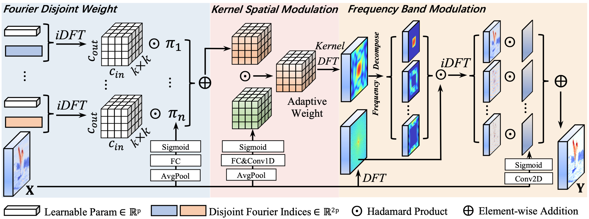

# FDConv

**[CVPR 2025]** Official implementation of *Frequency Dynamic Convolution for Dense Image Prediction*.  
FDConv enhances dynamic convolution by learning frequency-diverse weights in the Fourier domain, achieving state-of-the-art performance with minimal parameter overhead.

The code is being organized.

[](https://arxiv.org/abs/XXXX.XXXX) 



## 🚀 Key Features

- **Fourier Disjoint Weight (FDW):** Constructs frequency-diverse kernels by learning disjoint spectral coefficients, eliminating parameter redundancy.
- **Kernel Spatial Modulation (KSM):** Dynamically adjusts filter responses at the element-wise level using local-global feature fusion.
- **Frequency Band Modulation (FBM):** Modulates spatial-frequency bands adaptively for context-aware feature extraction.
- **Plug-and-Play:** Seamlessly integrates into ConvNets and Transformers.

## 📈 Performance Highlights

| Task                  | Method       | Metrics (Improvement)  | Params Cost |
| --------------------- | ------------ | ---------------------- | ----------- |
| Object Detection      | Faster R-CNN | AP↑2.2%                | **+3.6M**   |
| Instance Segmentation | Mask R-CNN   | AP<sup>mask</sup>↑2.8% | +3.6M       |
| Semantic Segmentation | UPerNet      | mIoU↑3.1%              | +3.6M       |

**Outperforms CondConv (+90M), DY-Conv (+75M), and ODConv (+65M) with 1/20 parameters!**

## 🛠 Installation

You can install mmdet following the guidence of [mmdetection](https://github.com/open-mmlab/mmdetection/tree/dev-2.x).

## 🏎️ Quick Start

```python
from fdconv import FDConv

# Replace standard convolution in your model
model.conv = FDConv(in_channels=64, out_channels=64, kernel_size=3, n_freq_groups=64)
```

## 📖 Citation

If you find this work useful, please cite:

```
@InProceedings{chen2025fdconv,
  title={Frequency Dynamic Convolution for Dense Image Prediction},
  author={Chen, Linwei and Gu, Lin and Li, Liang and Yan, Chenggang and Fu, Ying},
  booktitle={CVPR},
  year={2025}
}
```

## Acknowledgment

This code is built using [mmsegmentation](https://github.com/open-mmlab/mmsegmentation), [mmdetection](https://github.com/open-mmlab/mmdetection/tree/dev-2.x) libraries.

## Contact

If you encounter any problems or bugs, please don't hesitate to contact me at [chenlinwei@bit.edu.cn](mailto:chenlinwei@bit.edu.cn). To ensure effective assistance, please provide a brief self-introduction, including your name, affiliation, and position. If you would like more in-depth help, feel free to provide additional information such as your personal website link. I would be happy to discuss with you and offer support.